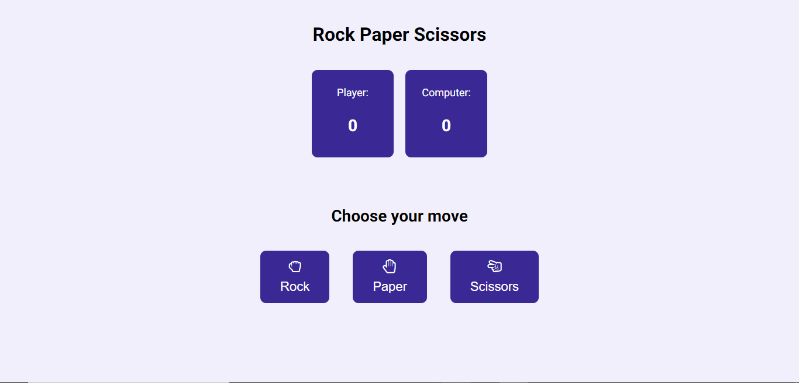

# 🎮 Rock Paper Scissors Game
Welcome to my Rock Paper Scissors game repository! This project is a simple implementation of the classic Rock Paper Scissors game using HTML, CSS, and JavaScript.

## 📋 Overview
This Rock Paper Scissors game is designed to provide a fun and interactive way for players to enjoy the classic game. It allows players to select their moves and compete against the computer's choices.

## 🚀 Key Features
- **🌐 User Interface**: The game provides a user-friendly interface where players can easily select their moves (rock, paper, or scissors).
- **🎉 Real-time Gameplay**: Players can see the game results immediately after making their choices.
- **🏆 Score Tracking**: The game keeps track of the player's and computer's scores as they play.
- **🌈 Dynamic Messaging**: Messages are displayed to inform players about the game outcome (win, lose, or tie).
- **🔄 Restart Functionality**: Players can restart the game and play again with the click of a button.

## 🛠️ Technologies Used
- HTML5
- CSS3
- JavaScript
- Git

## 💻 Live Demo
You can play the Rock Paper Scissors game live by visiting this [link](https://easy-rock-paper-scissors.netlify.app).

## ⚙️ Installation
1. Clone this repository.
2. Open the `index.html` file in your preferred web browser.

## 💡 Acknowledgments
I would like to thank various online tutorials and resources that contributed to the development of this Rock Paper Scissors game.

